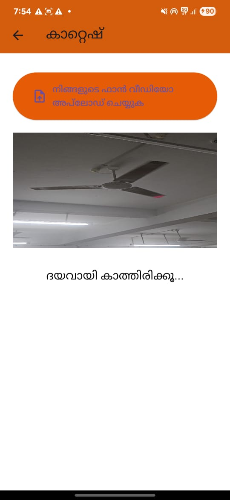

# Fan-o-Meter 🎯


## Basic Details
### Team Name: Creative Coders


### Team Members
- Team Lead: Gokul Anand - RIT Kottayam
- Member 2: Dhanshyam S - RIT Kottayam

### Project Description
An app that counts how many times a fan rotates — because nobody ever needed this, but we did it anyway.

### The Problem (that doesn't exist)
Sometimes you're sitting under a fan and you suddenly think,
"How many times has this thing spun today?"
No? Neither did we — but it was 100% worth building an app for it.


### The Solution (that nobody asked for)
Introducing Fan-o-Meter — the world's first (and probably last) app that uses your phone or webcam to count how many times your fan rotates.
Why? Because we wanted to track fan productivity.
Also, science.

## Technical Details
### Technologies/Components Used
For Software:

- Languages used: Dart (Flutter), Python (for backend/CV logic)
- Frameworks used: Flutter
- Libraries used: OpenCV, NumPy
- Tools used: Android Studio, Webcam/phone camera
For Hardware:
- A fan (any species)
- A visual marker on one blade (e.g., tape, dot, or sticker)
- A stable phone/webcam mount
- Your faith in technology
### Implementation
For Software:
# Installation
```
git clone https://github.com/Dhanshyam7/Fan_count_app
cd fan_rotation_app
```

# Run
python server.py

### Project Documentation
For Software:- Languages used: Dart (Flutter), Python (for backend/CV logic)
- Frameworks used: Flutter
- Libraries used: OpenCV, NumPy
- Tools used: Android Studio, Webcam/phone camera

# Screenshots (Add at least 3)

*Home screen with the option to start fan tracking*


*Tracking the fan using computer vision. You can almost feel the breeze.*


*Precise, unnecessary stats on how much your fan has been spinning.*

*final output*


### Project Demo
# Video
[video](vdo.mp4)
*full demonstrartion*

Made with ❤️ at TinkerHub Useless Projects 


